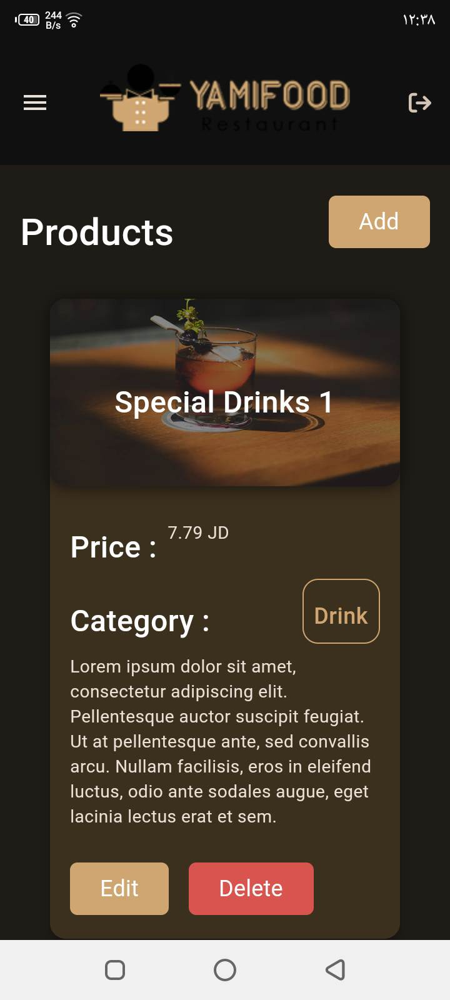

Yamifood Restaurant | E-commerce Application 

# Packages
    1. Bootstrap
    2. Get
    3. Fontawesome
    4. Google Maps
    5. Geolocator
    6. MOOOORE

# Firebase
    1. init
    2. active the authentication with email
    3. active the firestore
    4. set the firestore role by enable read always but write need auth
    5. active the messaging and add the api
    6. add the google maps api

## Customer
            

## Authentication
    

## Admin
               

## Driver
         
