# Flutter Restaurant Delivery App with Admin and Driver Panels

This project is a Flutter-based restaurant delivery application that includes three primary components: a customer app for food ordering, an admin panel for restaurant management, and a driver panel for delivery logistics. The app integrates with Firebase to provide authentication, real-time data synchronization, push notifications, and other backend services.

---

## Table of Contents
1. [Overview](#overview)
2. [Features](#features)
   - [Customer App](#customer-app)
   - [Admin Panel](#admin-panel)
   - [Driver Panel](#driver-panel)
3. [Setup and Installation](#setup-and-installation)
   - [Flutter Installation](#flutter-installation)
   - [Firebase Setup](#firebase-setup)
   - [Project Setup](#project-setup)
4. [Usage](#usage)
   - [Customer App Usage](#customer-app-usage)
   - [Admin Panel Usage](#admin-panel-usage)
   - [Driver Panel Usage](#driver-panel-usage)
5. [Contributing](#contributing)
6. [Screenshots](#screenshots)

---

## Overview
The Flutter-based restaurant delivery app is designed to streamline food ordering and delivery, providing a seamless experience for customers, efficient management for restaurant administrators, and effective logistics for delivery drivers. It uses Flutter for cross-platform compatibility and Firebase for robust backend services.

## Features

### Customer App
- **Menu Browsing**: View detailed restaurant menus and add items to the cart.
- **Order Placement**: Place orders with various payment options.
- **Order Tracking**: Track order status in real-time.
- **User Profiles**: Manage profiles, order history, and saved addresses.
- **Push Notifications**: Receive notifications for order updates and promotions.

### Admin Panel
- **Order Management**: Manage orders, assign drivers, and update order statuses.
- **Restaurant Management**: Update restaurant information, menus, and prices.
- **Driver Management**: Manage and track delivery drivers.
- **Reports and Analytics**: Generate reports and analyze key metrics.

### Driver Panel
- **Order Management**: View assigned orders and update order status.
- **Navigation and Routing**: Real-time navigation with mapping services.
- **Earnings Tracking**: Track earnings and completed deliveries.

---

## Setup and Installation

### Flutter Installation
1. Download and install the latest stable version of the Flutter SDK from the [Flutter website](https://flutter.dev/).
2. Set up environment variables and ensure Flutter is installed correctly by running `flutter doctor`.
3. Install an IDE like Android Studio or Visual Studio Code, and set up Flutter and Dart plugins.

### Firebase Setup
1. Create a Firebase project in the Firebase Console.
2. Add your Flutter apps (Android and iOS) to the Firebase project.
3. Download the configuration files (`google-services.json` for Android and `GoogleService-Info.plist` for iOS), and place them in the appropriate locations within your Flutter project.
4. Enable necessary Firebase services, such as Firebase Authentication, Firestore, and Firebase Cloud Messaging.

### Project Setup
1. Create a new Flutter project in your IDE.
2. Add Firebase packages to `pubspec.yaml` and run `flutter pub get` to install them.
3. Initialize Firebase in your Flutter app during startup.

---

## Usage

### Customer App Usage
1. Launch the customer app to browse restaurant's menu.
2. Add items to the cart and proceed to checkout, choosing delivery or pickup.
3. Track order status in real-time and receive push notifications for updates.
4. Manage user profiles, order history, and saved addresses.

### Admin Panel Usage
1. Access the admin panel via a web browser to manage restaurant operations.
2. Monitor orders, assign drivers, and update order statuses.
3. Manage restaurant information, including menus, prices, and hours of operation.
4. Generate reports and analyze sales and delivery metrics.

### Driver Panel Usage
1. Open the driver app to view assigned orders and navigate to delivery locations.
2. Update order status during the delivery process.

---

## Contributing
Contributions to the project are welcome. If you'd like to contribute, please follow these steps:
1. Fork the repository.
2. Create a new branch for your feature or fix.
3. Submit a pull request with a detailed description of your changes.

Please ensure your code follows the project's style guidelines and includes appropriate tests.

---

## Screenshots

    Customer
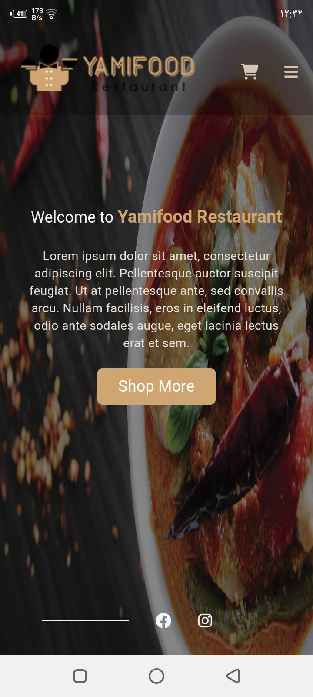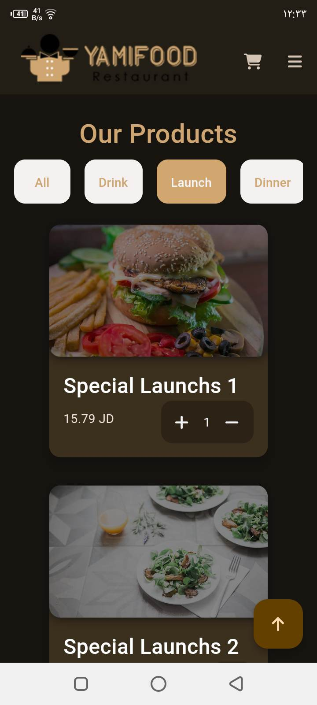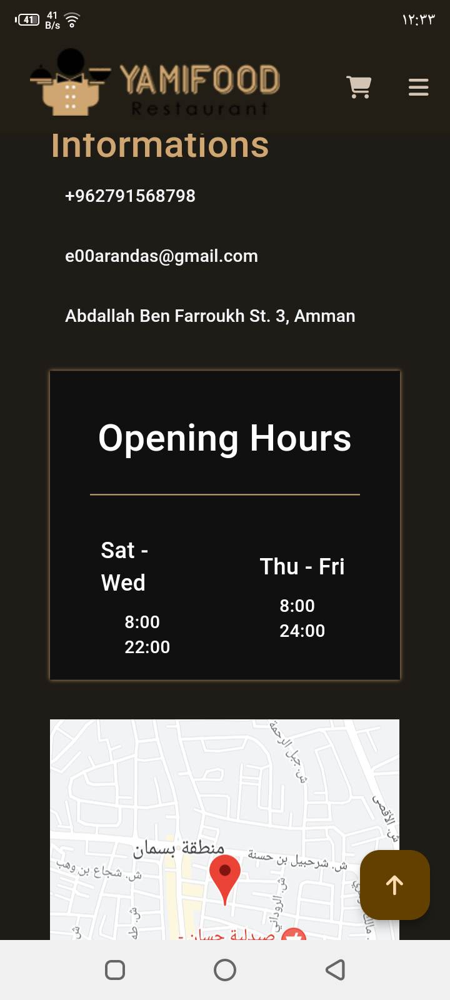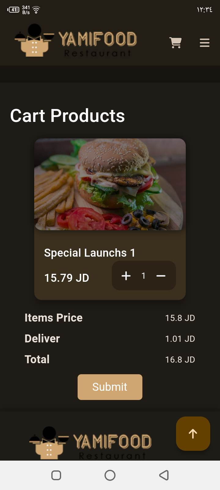

    Authentication
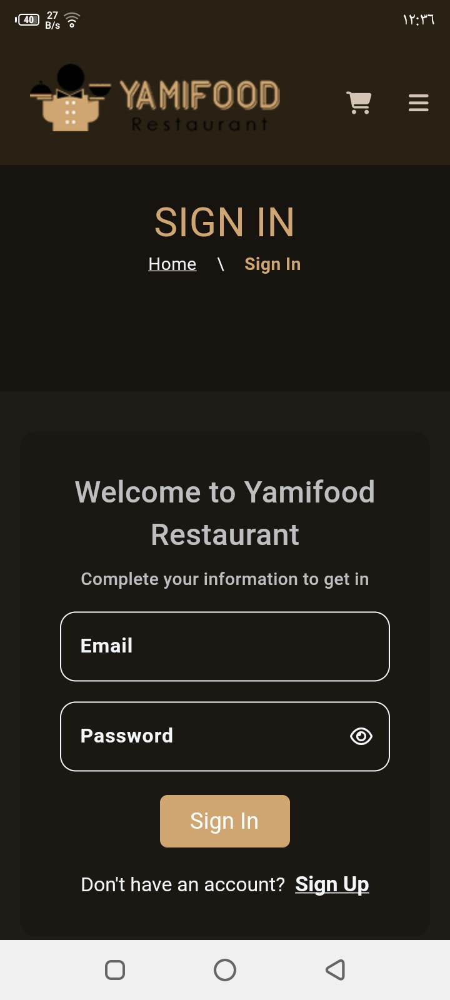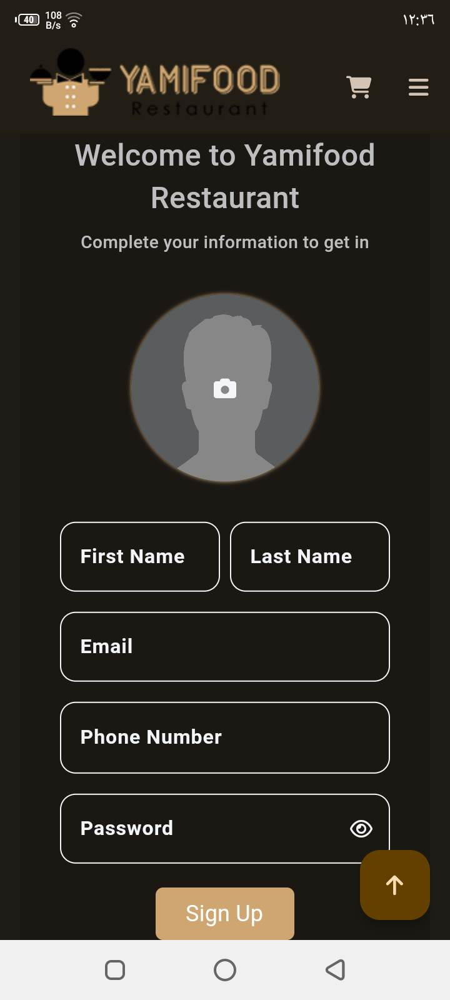

    Admin
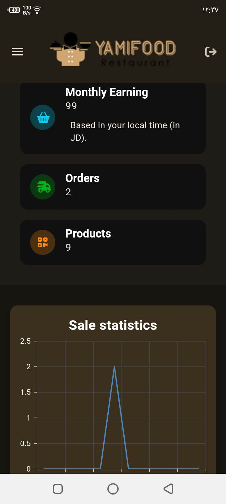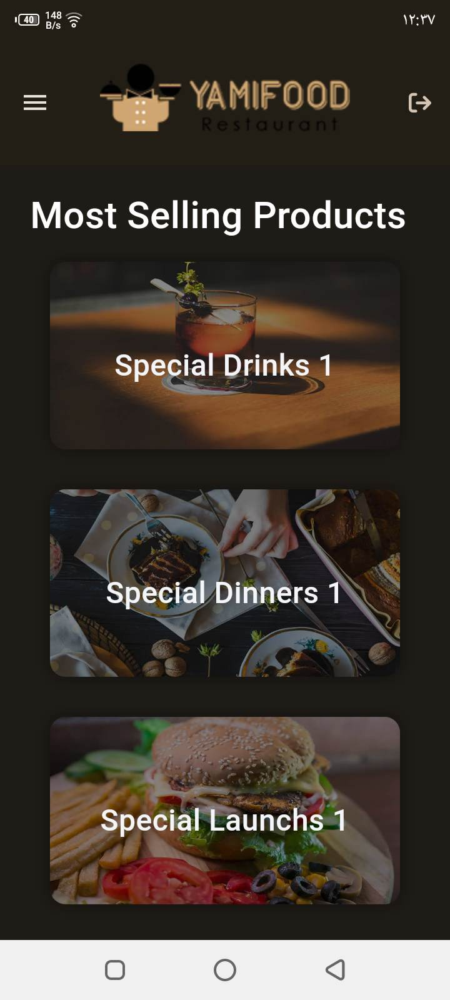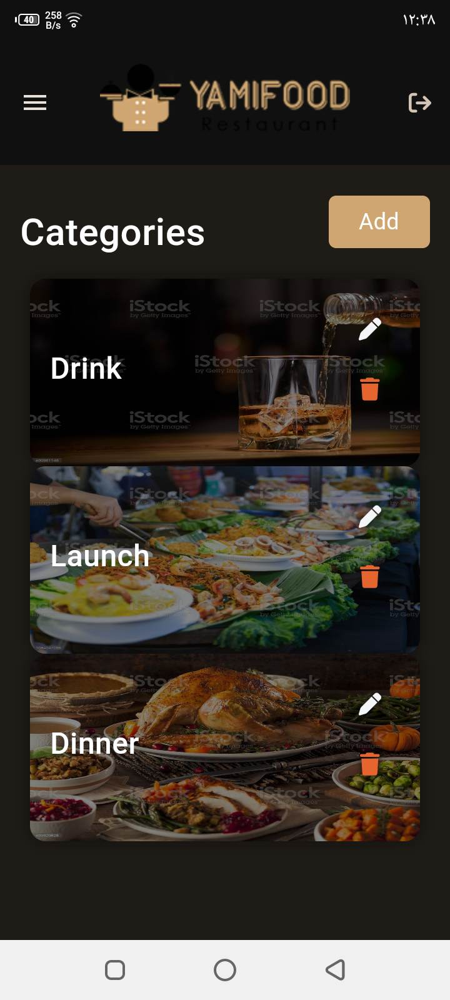

    Driver
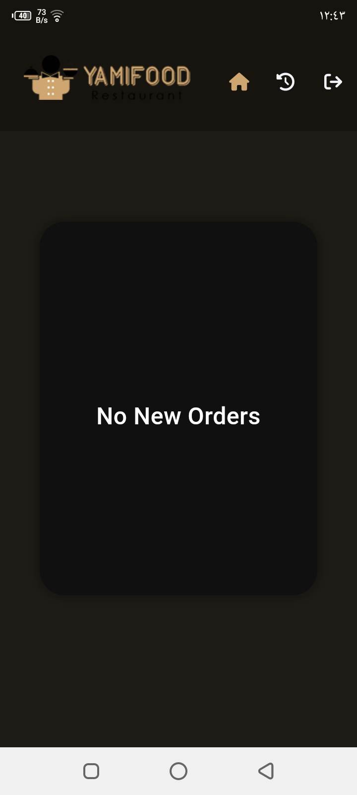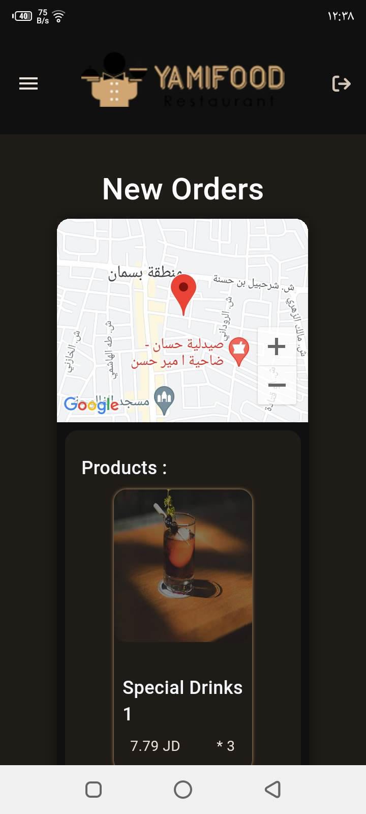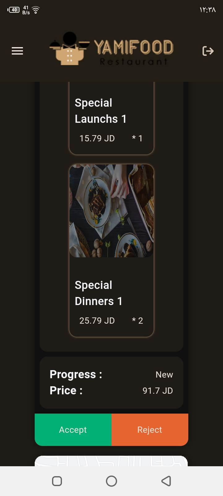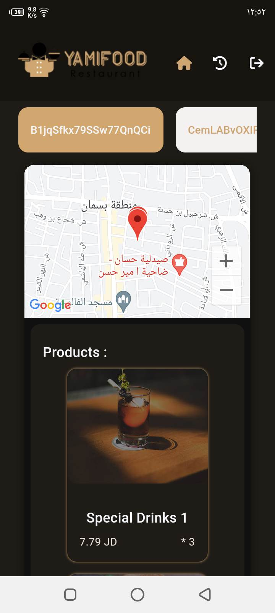
